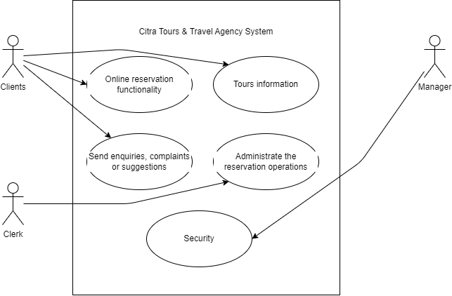
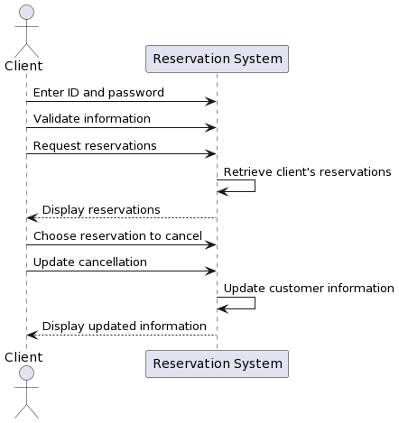
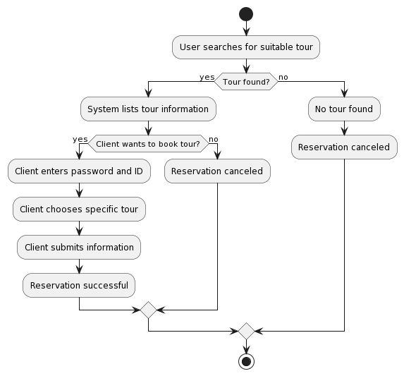

Don't forget to hit the :star: if you like this repo.

## Set:

**Name: Yeoh Chong Yi**

**Matrix No: A22EC0295**

**Section: 01**

## Answer  
1. Incremental model. Incremental model is flexible to changing requirements. Incremental model allows frequent collaboration with stakeholders. Incremental holders allows changes to be delivered quickly.
2. Functional requirements:  
   i. The registered users (clients) can access the online system to make a tour reservation.  
   ii. The registered users (clients) can view information about the tours available.  
   iii. The registered users (clients) can cancel a previous reservation that he/she made.  

   Non-functional requirements:  
   i. For security purposes, the system should provide clerk a login ID and password by the manager to be able to access the database of the Citra’s travel agency.  
   ii. For performance and scalability, The system should be capable of handling a large number of concurrent users, ensuring fast response times and minimal downtime. It should be scalable to accommodate increasing user demands and tour offerings.  
3. ### Scenario: Make a tour reservation
| Column | Description |
|-----------------------------|----------------------------------|
| **Pre-conditions:**         |- John is a registered client of Citra's travel agency. |
|                             |- John has logged into his account on the agency's website. |
|                             |- The "Tropical Paradise Tour" is listed as an available tour. |
|                             |- John has a valid payment method. |
| **Normal Event(s):**        |- John navigates to the tour details page of the "Tropical Paradise Tour". |
|                             |- John selects his preferred tour date. |
|                             |- John clicks on the "Reserve Now" button. |
|                             |- A reservation form is displayed, pre-filled with John's contact details. |
|                             |- John verifies and confirms the information in the reservation form. |
|                             |- John securely enters his payment details. |
|                             |- The system validates the payment and generates a confirmation page. |
|                             |- The clerk receives a notification about the new reservation. |
|                             |- The clerk reviews the reservation details and confirms its availability. |
|                             |- The clerk processes the payment. |
|                             |- The system generates a receipt with reservation and payment information. |
|                             |- The receipt is automatically sent to John's registered email address. |
| **Abnormal Event(s):**      |- John encounters an error while entering his payment details. |
|                             |- The reservation form fails to validate John's contact information. |
|                             |- The clerk is unable to confirm the reservation due to unavailability. |
| **Post-conditions:**        |- John receives a confirmation page for his reservation. |
|                             |- The clerk has processed the payment and confirmed the reservation. |
|                             |- John receives an email with the receipt containing reservation and payment details. |
|                             |- The tour slot for the selected date is reserved for John. |  
4. Actors:  
   i. Clients  
   ii. Clerk  
   iii. Manager  

   5 use cases:  
   i. Online reservation functionality  
   ii.  Tours information
   iii.  Send enquiries, complaints or suggestions
   iv. Administrate the reservation operations  
   v. Security  

   Use case diagram:   
      
5. Classes:  
   i. Client
   ii. Clerk  
   iii. Manager  
   iv. Tour  
   v. TourReservation  
6.    
7.   

## Contribution 🛠️
Please create an [Issue](https://github.com/drshahizan/learn-php/issues) for any improvements, suggestions or errors in the content.

You can also contact me using [Linkedin](https://www.linkedin.com/in/drshahizan/) for any other queries or feedback.

